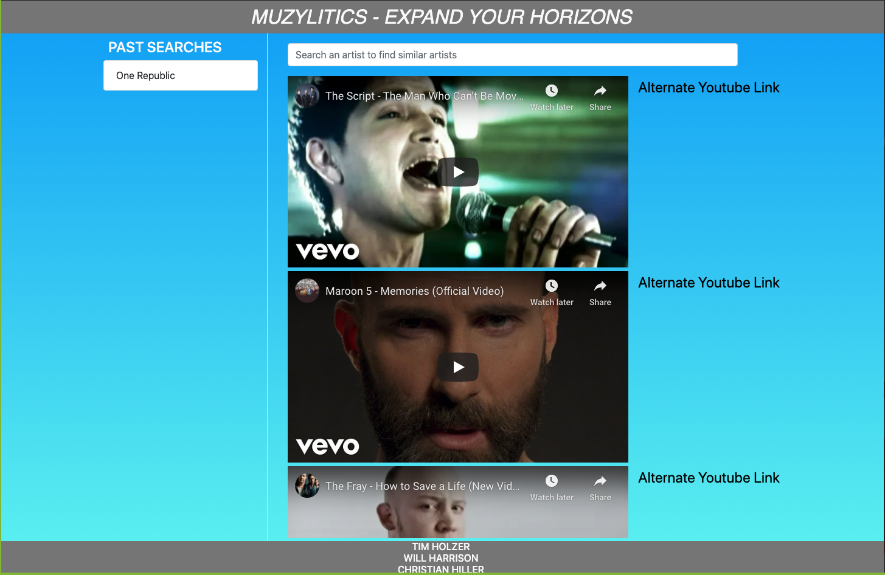

# uofu-proj1
A web app where you search a band name and get back Youtube links to five songs by similar bands.

<a href="https://timholzer.github.io/uofu-proj1/">Github Pages Link</a>

-When an band's name is entered into the search field,
-Then the tasteDive API returns the names of 5 similar bands.
-When there is an error a message is displayed to suggest another song.
-When there are results the search term gets added to a search history local storage that is automatically displayed.
-The 5 similar bands are then sent to the Youtube API as search terms
-Then Youtube returns video ID's that are used to embed the video into the page.
-Since most music related videos on Youtube don't allow embedding, a line to watch on Youtube is provided.
-When a new band is searched the old videos get removed and replaced.
-When you click on a band name in the history, then it is searched for.

